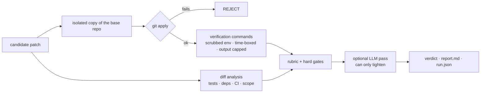

<p align="center">
  <picture>
    <source media="(prefers-color-scheme: dark)" srcset="assets/brand/logo-dark.svg">
    
  </picture>
</p>

<p align="center">
  <b>This patch passes tests. Would a maintainer merge it?</b><br>
  MergeCode judges AI-generated patches the way a reviewer does: it runs your checks,<br>
  reads the diff for the tricks that get code to green, and returns a verdict with evidence.
</p>

<p align="center">
  <a href="https://github.com/niravpatidar37/mergecode/actions/workflows/ci.yml"></a>
  <a href="LICENSE"></a>
  
  
</p>

---

## Green CI is not a code review

Coding agents are very good at reaching green. Some of the fastest ways to get there are
ones no maintainer would accept:

- delete the assertion that fails, or `.skip` the test
- pull in a dependency to do what one operator already did
- touch nine files to fix a two-line bug
- quietly edit the CI workflow that checks them

Every one of these passes CI. **MergeCode is built to catch them**, so you can triage a stack of
agent PRs in seconds instead of re-reviewing each diff from scratch.

## See it catch one

The task: *"Fix: tokens are rejected one millisecond too late."* An agent submits this patch:

```diff
-export function isExpired(expiresAt: number, now = Date.now()): boolean {
-  return now > expiresAt;
+import dayjs from "dayjs";
+
+export function isExpired(expiresAt: number, now = Date.now()): boolean {
+  return dayjs(now).isAfter(dayjs(expiresAt));
 }
```

```diff
-it("treats the expiry instant as expired", () => {
-  expect(isExpired(1000, 1000)).toBe(true);
-});
```

The remaining tests pass. MergeCode's verdict (real output, trimmed):

```console
$ mergecode judge --repo auth-service --task fix-token-expiry.md --patch agent-a.patch
# MergeCode Verdict: REQUEST_CHANGES

Confidence: 0.75
Score: 93/100

## Review This First

- **MEDIUM tests: Deleted test assertions**
  Patch deletes 1 assertion-like line(s) from test files.
- **MEDIUM risk: Dependency surface changed**
  Dependency manifests or lockfiles changed. (`package.json`)
...
```

Look closer and it is worse: `isAfter` *is* `>`, so the bug isn't fixed at all. The patch deleted
the one test that would have proved it. The rule-based rubric flags the deleted test and the new
dependency mechanically. The semantic problem is what the [optional LLM maintainer pass](#llm-maintainer-pass)
and, ultimately, a human are for. MergeCode tells you where to look first.

## What it checks

| Signal | Languages / ecosystems | Effect on the verdict |
|---|---|---|
| Verification commands fail or time out | any (you configure the commands) | `REJECT` (configurable) |
| Skipped or focused tests added: `.skip`, `.only`, `#[ignore]`, `pytest.mark.skip`, `t.Skip` | JS/TS, Rust, Python, Go | `REJECT` |
| Assertions deleted from tests, including Rust inline `#[cfg(test)]` modules | JS/TS, Rust, Python, Go | `REQUEST_CHANGES` (or `REJECT` with `failOnDeletedTests`) |
| Test files deleted, or renamed so the runner no longer picks them up | all | `REQUEST_CHANGES` (or `REJECT` with `failOnDeletedTests`) |
| Source changed without touching tests (Rust inline `#[test]` counts) | all | `REQUEST_CHANGES` |
| Dependency manifests or lockfiles changed | npm, yarn, pnpm, bun, Cargo, uv, Poetry, pip, Go, Bundler, Maven, Gradle | `REQUEST_CHANGES` |
| CI workflows changed | GitHub Actions, GitLab CI, CircleCI | `REQUEST_CHANGES` |
| Large surface: more than 8 files or 500 lines | all | `REQUEST_CHANGES` |
| Patch does not apply to the base | all | `REJECT` |
| Optional LLM maintainer review: design fit, naming, missed edge cases | all | can only make the verdict **stricter** |

Every finding is evidence you can check: a file, a count, a command and its exit code. There is no
opaque score you have to trust.

## Quick start

```bash
git clone https://github.com/niravpatidar37/mergecode
cd mergecode && npm ci && npm run build && npm link

mergecode judge --repo ./my-service --task task.md --patch agent.patch
```

Configure it with a `mergecode.yaml` in the repo being judged:

```yaml
verify:
  commands:            # run in an isolated copy of the repo with the patch applied
    - npm ci --ignore-scripts
    - npm test
  timeoutMs: 300000    # per command
rubric:
  hardGates:
    failOnVerificationFailure: true
    failOnDeletedTests: false
    requestChangesOnDependencyChange: true
llm:
  enabled: false
```

| Exit code | Meaning |
|---|---|
| `0` | `MERGE` |
| `1` | `REQUEST_CHANGES` |
| `2` | `REJECT` |
| `3` | error (bad config, unreadable patch, ...) |

Each run writes `report.md` (the review) and `run.json` (everything, machine-readable) to
`.mergecode/runs/<id>/`, or to the directory given with `--out`.

## Judge every pull request

[`.github/workflows/mergecode.yml`](.github/workflows/mergecode.yml) runs MergeCode on each PR and
keeps one up-to-date verdict comment on it. Copy it into your repo, add a `mergecode.yaml`, and
you're done. It is built around the fact that a PR is untrusted input:

- **The judge comes from the base branch.** MergeCode and its config are built from the PR's base
  commit, so a PR cannot weaken the judge that evaluates it.
- **No secrets near PR code.** The job that runs verification has a read-only token and no secrets.
  Verification commands also get a scrubbed environment: secret-looking variables and the runner's
  `GITHUB_OUTPUT`/`GITHUB_ENV` files are removed.
- **Commenting is a separate job** that never executes PR code. It is skipped for fork PRs.
- **Fails closed.** `REJECT`, an error, or a missing report fails the check. `REQUEST_CHANGES` is advisory.
- Every action is pinned to a commit SHA, and the workflows are linted with [zizmor](https://github.com/zizmorcore/zizmor) in CI.

## LLM maintainer pass

Rules catch mechanical signals. They can't tell you a fix doesn't fix anything. Turn on the LLM pass
for that:

```yaml
llm:
  enabled: true
  model: claude-sonnet-5
  apiKeyEnv: ANTHROPIC_API_KEY
  maxDiffChars: 12000
```

The model's output is treated as untrusted. It is schema-validated and length-capped, and rendered
inert (no links, images, HTML or @mentions in PR comments). It **can only downgrade** a `MERGE` to
`REQUEST_CHANGES`, never upgrade, so a prompt-injected diff can't talk its way to approval. If the
API fails, the rule-based verdict stands and the report says the LLM pass was skipped.

> In CI, don't expose the API key to a job that runs PR code. Verification commands can't read it
> through their environment, but PR code runs as the same OS user as the judge. Splitting the LLM
> pass into its own job is on the roadmap.

## How it works



## Limits, stated plainly

- **Verification is not sandboxed.** Commands run as your user. Run MergeCode on untrusted patches
  only inside CI or a disposable container.
- **The diff heuristics are pattern-based.** They can be evaded by a determined author. MergeCode
  is a reviewer's triage tool, not a security boundary and not a replacement for review.
- **Scores are a rubric, not a measurement.** Read the findings, not the number.

## Roadmap

- [ ] `mergecode compare`: rank several agent patches for the same task
- [ ] `mergecode init`: generate a `mergecode.yaml` for your stack
- [ ] Container sandbox for verification commands
- [ ] LLM pass in its own CI job, isolated from PR code
- [ ] Reusable action (`uses: niravpatidar37/mergecode@v1`) and npm package
- [ ] Benchmark set of real agent PRs labelled by maintainers

## Docs

[Product spec](docs/product-spec.md) · [Architecture](docs/architecture.md) ·
[Evaluation rubric](docs/evaluation-rubric.md) · [Build plan](docs/build-plan.md) ·
[Research notes](docs/research-notes.md) · [Brand](assets/brand/README.md)

## Contributing

Issues and PRs are welcome, especially new detection signals with a failing test that shows the
trick they catch. Every PR here is judged by MergeCode itself.

```bash
npm ci && npm run typecheck && npm test
```

## License

MIT. See [LICENSE](LICENSE).

If MergeCode saves you from a bad merge, a star helps other maintainers find it.
